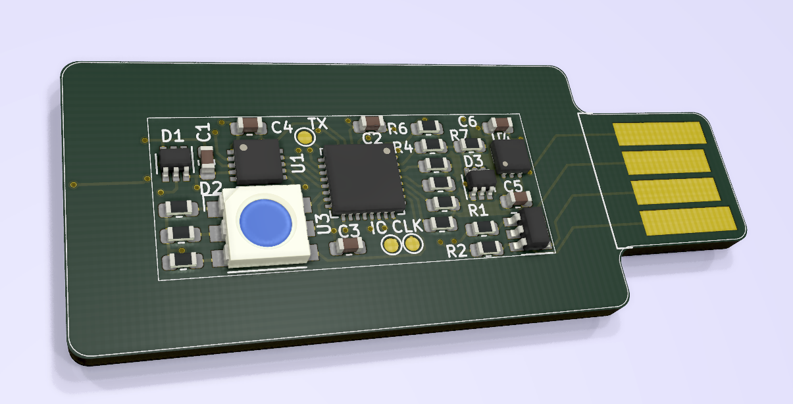
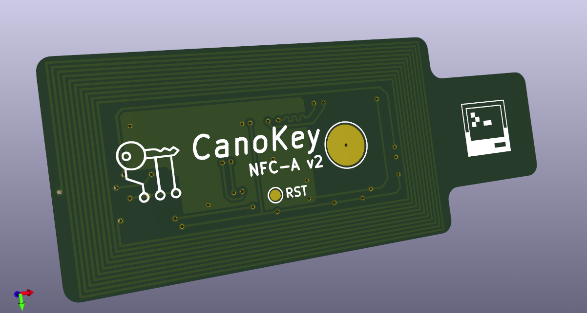

# CanoKey NFC-A v2

Этот репозиторий содержит схемы, проекты печатных плат и файлы Gerber для Canokeys.

В данном каталоге расположена доработанная версия платы CanoKey NFC-A

Преимущества:

- Проект создан в полноценном САПР  KiCad
- Все компоненты доступны в LCSC
- Проект подготовлен для автоматической сборки на JLCPCB
- Хорошо оформлена принципиальная схема
- Аппаратно совместима с CanoKey NFC-A
- Переработан дизайн и топология печатной платы

Отличия в аппаратной части:

- Переработана ESD защита 
- Добавлен 3х цветочный светодиод 
- Изменена концепция конфигурации устройства (HW-Rev-CFG), позволит иметь большее разнообразие вариантов
- Более чувствительная NFC антена
- Согласована дифференциальная пара USB

Библиотека компонентов и небольшие инструкции, можно найти в публичном репозиторие

https://github.com/MuratovAS/KiCadLibrary

